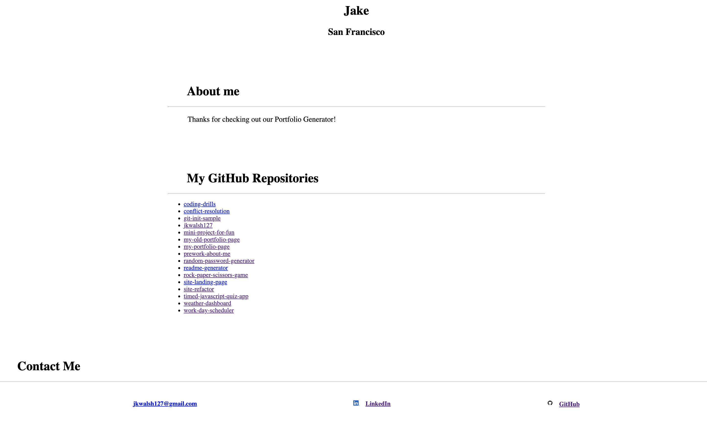

# Portfolio Generator

|   Languages   | Used      |  Node Modules   | Used      |   runtime   | Used      |
| ----------- | ----------- | ----------- | ----------- | ----------- | ----------- |
| HTML        |   ✅        | Axios      |   ✅        | node.js     |   ✅        |
| CSS         |    ✅        | Inquirer  |    ✅       |
| JavaScript  |    ✅        |  

## Usage

Clone the repository, run the command 'npm install' to install the necessary node modules, run the command 'node index.js' to initiate the prompts, answer them as you see fit, and at the end an html file called 'portfolio.html' will be generated for you.

## Description

This project uses the power of node.js to generate a portfolio page for a user based on a series of simple prompts. The page will display the user's name, their location, a bio section, a list of their github repositories along with links to each, aswell as a list of contact links that will allow visitors to write them an email and checkout their linkedIn and GitHub profiles. 

### Example generated page

### Collaborators

Jonathan Bridge:

email: jvbridge@gmail.com

linkedIn: https://www.linkedin.com/in/jonathan-bridge/

Jonathan's portfolio page: https://jvbridge.github.io/portfolio/

Jake Walsh:

email: jkwalsh127@gmail.com

linkedIn: https://www.linkedin.com/in/jake--walsh/

Jake's portfolio page: https://jkwalsh127.github.io/my-portfolio-page/

#### Liscense 

MIT

Permission is hereby granted, free of charge, to any person obtaining
a copy of this software and associated documentation files (the
"Software"), to deal in the Software without restriction, including
without limitation the rights to use, copy, modify, merge, publish,
distribute, sublicense, and/or sell copies of the Software, and to
permit persons to whom the Software is furnished to do so, subject to
the following conditions:

The above copyright notice and this permission notice shall be
included in all copies or substantial portions of the Software.

THE SOFTWARE IS PROVIDED "AS IS", WITHOUT WARRANTY OF ANY KIND,
EXPRESS OR IMPLIED, INCLUDING BUT NOT LIMITED TO THE WARRANTIES OF
MERCHANTABILITY, FITNESS FOR A PARTICULAR PURPOSE AND
NONINFRINGEMENT. IN NO EVENT SHALL THE AUTHORS OR COPYRIGHT HOLDERS BE
LIABLE FOR ANY CLAIM, DAMAGES OR OTHER LIABILITY, WHETHER IN AN ACTION
OF CONTRACT, TORT OR OTHERWISE, ARISING FROM, OUT OF OR IN CONNECTION
WITH THE SOFTWARE OR THE USE OR OTHER DEALINGS IN THE SOFTWARE.